# Professional monitoring with Hashicorp Consul and Smashing!


- [Overview](#overview)
- [Hands On](#hands-on)
    - [Login to the terminal](#login-to-the-terminal)
    - [Check Jenkins is running](#check-jenkins-is-running)
    - [Check Artifactory is running](#check-artifactory-is-running)
    - [Install Consul](#install-consul)
    - [Start Consul](#start-consul)
    - [Check Consul is running](#check-consul-is-running)
    - [Configure Jenkins Service in Consul](#configure-jenkins-service-in-consul)
    - [Configure Artifactory Service in Consul](#configure-artifactory-service-in-consul)
    - [Check Consul reponds to a service outage](#check-consul-reponds-to-a-service-outage)
    - [Configure Smashing](#configure-smashing)
    - [Check Smashing can receive updates](#check-smashing-can-receive-updates)
    - [Configure Jenkins watch in Consul](#configure-jenkins-watch-in-consul)
    - [Configure Artifactory watch in Consul](#configure-artifactory-watch-in-consul)
    - [Shutdown Jenkins and Artifactory](#shutdown-jenkins-and-artifactory)
    - [Startup Jenkins and Artifactory](#startup-jenkins-and-artifactory)
- [Conclusion](#conclusion)
- [Hashicorp training](#hashicorp-training)
- [Resources](#resources)
- [Appendix](#appendix)
    - [Setting up the Playground Environment](#setting-up-the-playground-environment)
    - [Tearing down the Playground Environment](#tearing-down-the-playground-environment)

# Overview

A typical DevOps Engineer could be responsible for the maintenance of many services in a DevOps pipeleine such as a build server, binary storage solution, a a code repository service, wiki and a ticket tracking service.

High agility and a mature DevOps capability require these services to be running 100% of the time. An outage of any service will impact the route to live of any change. People will be walking up to your desk, wondering what is going on!

Using Hashicorp's Consul, we can intelligently monitor the status of these services and react in real time to unpredicted behaviour. You can therefore identifiy the issue before the rest of your end users do.

However, there will be occassions when outages require time to fix. How do you keep your end users informed without having to update them on a continual basis? Display this information from Consul in an easy to view dashboard on TVs around your office using Smashing.

It looks smart, tidy, and provides everyone the information they need so you can be left to bring the services back on line in the quickest time possible.

In this playground we will learn how easy it is to implement monitoring of your services using Hashicorp Consul!

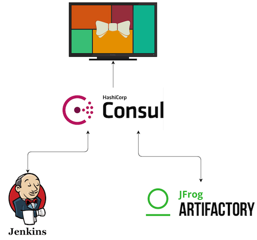

# Hands-on
### Login to the terminal 
Using the information provided. Enter the IP in a modern browser.

Login using the credentials provided.

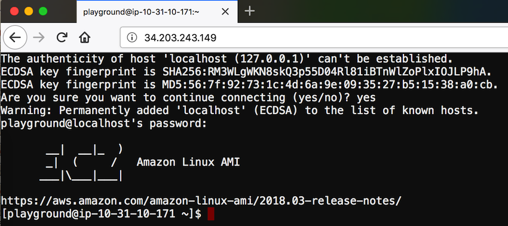

### Check Jenkins is running

In a separate tab, navigate to http://\<IP\>:8080 and confirm Jenkins is up.


### Check Artifactory is running

In a separate tab, navigate to http://\<IP\>:8081 and confirm Artifactory is up.

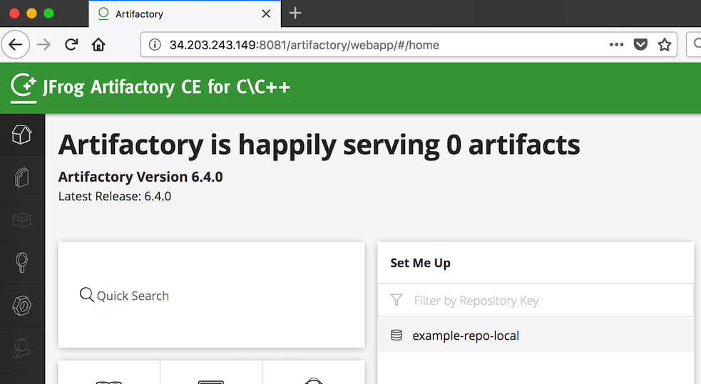

(If you wish to login, default username and pw is admin/password

### Install Consul

Use the terminal browser tab previously opened.

Create a bin directory:

```
$mkdir ~/bin
```

Download Consul:

```
$wget https://releases.hashicorp.com/consul/1.2.3/consul_1.2.3_linux_amd64.zip
```

(Version 1.2.3 was the latest at time of writing. Always check the Consul website for the latest version.)

Unpack the archive into the bin directory:

```
$unzip consul_1.2.3_linux_amd64.zip -d ~/bin
```

Check that the Consul command is working:

```
$consul
```
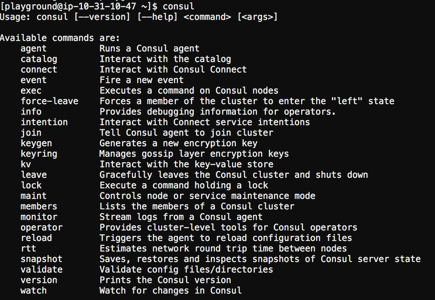

### Start Consul

Create a data and config directory for consul:
```
$mkdir ~/consul_data && mkdir ~/consul_config
```

To run Consul, run the following:

```
$nohup consul agent -dev -data-dir=$HOME/consul_data -ui -client 0.0.0.0 -config-dir=$HOME/consul_config &
```
Argument explanation:

* agent = Runs a Consul agent.
* -client = Sets the address to bind for client access.
* -config-dir = Path to a directory to read configuration files from.
* -data-dir = Path to a data directory to store agent state.
* -dev  =  Starts the agent in development mode. (This mode is useful for bringing up a single-node Consul environment quickly and easily. It is not intended to be used in production as it does not persist any state.)
* -ui   = Enables the built-in static web UI server.

Non Consul parameters
* nohup = Run a command immune to hangups. Command will still run even if the terminal is closed.
* & = Send process to the background.

### Check Consul is running

In a separate tab, navigate to http://\<IP\>:8500 and confirm Consul is up.

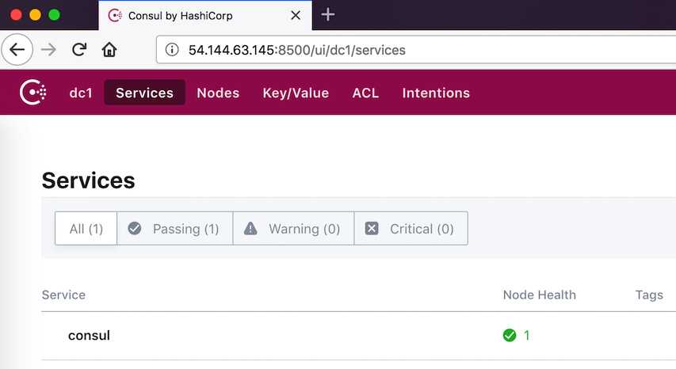

### Configure Jenkins Service in Consul

Navigate to the Consul service files.

```
$cd ~/devopsplaygroundsg02-hashicorpconsulandsmashing/consul/services
```

Use nano to configure the service definition file for Jenkins.

```
$nano jenkins.json
```

Replace <JENKINS INSTANCE> ...

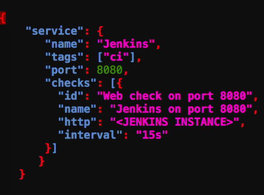

... with the ip and port of the Jenkins Server (localhost will work also)

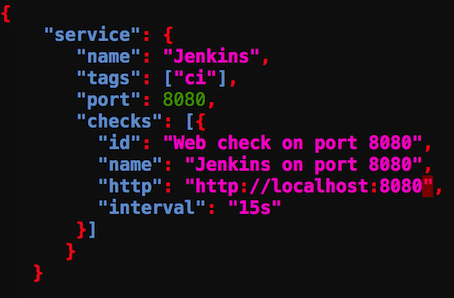

Move the Jenkins service definition file to the consul configuration directory.

```
$cp jenkins.json ~/consul_config/
```

Reload consul to pick up the latest changes.

```
$consul reload
```

Refresh the Consul ui. You should now see a Jenkins service with passing health checks.

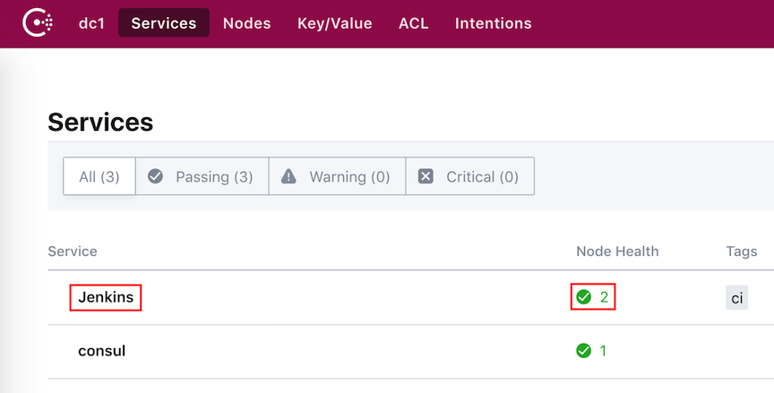

### Configure Artifactory Service in Consul

Navigate to the Consul service files.

```
$cd ~/devopsplaygroundsg02-hashicorpconsulandsmashing/consul/services
```

Use nano to configure the service definition file for Artifactory.

```
$nano artifactory.json
```

Replace <Artifactory INSTANCE> ...

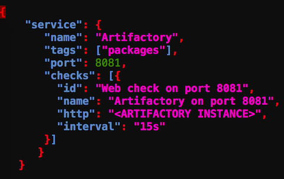

... with the ip and port of the Artifactory Server (localhost will work also)

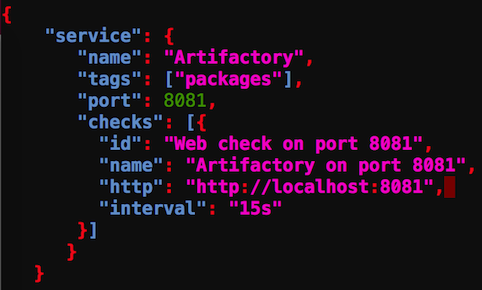

Move the Artifactory service definition file to the consul configuration directory.

```
$cp artifactory.json ~/consul_config/
```

Reload consul to pick up the latest changes.

```
$consul reload
```

Refresh the Consul ui. You should now see a Artifactory service with passing health checks.

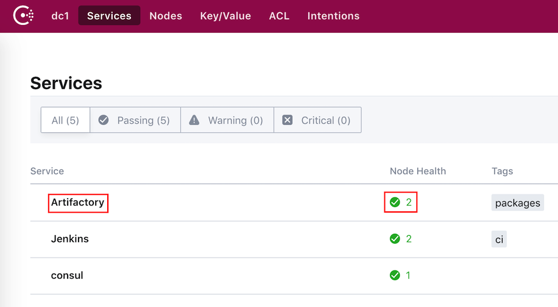

### Check Consul reponds to a service outage

Shutdown the Jenkins Service.

```
$sudo service jenkins stop
```

Check the Consul UI. Click on the Nodes tab and you can see Jenkins health check as critical.

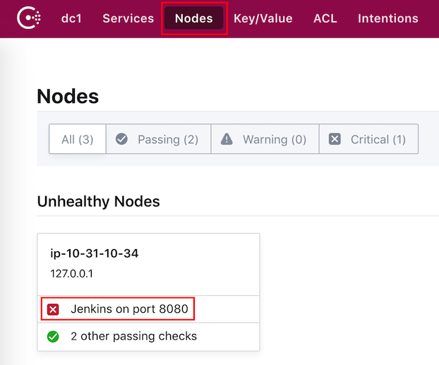

Bring Jenkins back up.

```
$sudo service jenkins start
```

Check the Consul UI. All services are now healthy.

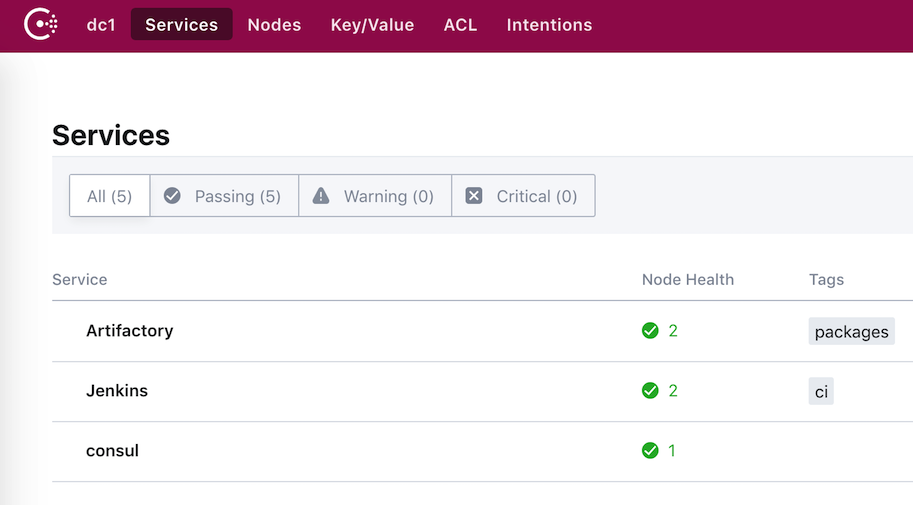

### Configure Smashing

Navigate to the Smashing directory.

```
$cd ~/devopsplaygroundsg02-hashicorpconsulandsmashing/smashing
```

Switch to the root user

```
$sudo su
```

Bundle the gems.

```
$bundle install
```

Start the Smashing service

```
$nohup puma config.ru &
```

Note: A known issue prevents us from using the traditional "smashing start" to start our dashboard.
For further details see - https://github.com/Shopify/dashing/issues/119

Check that the example smashing dashboard is accessible. In a browser, goto http://\<IP\>:9292/sample

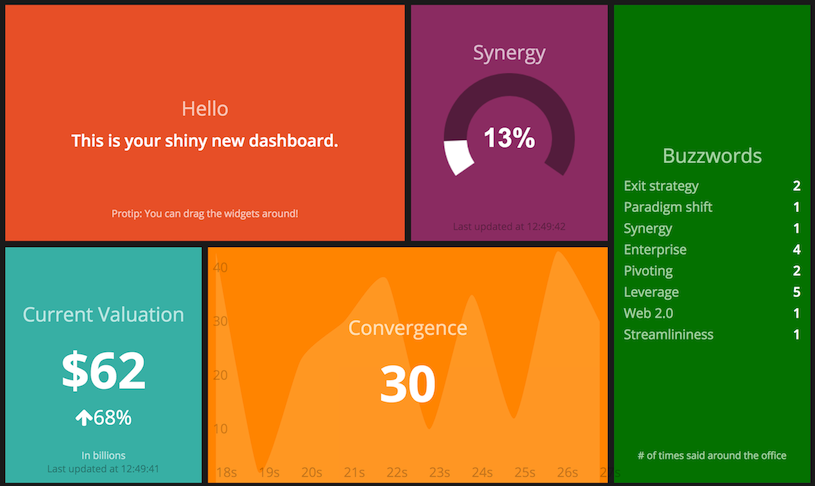

Check you can access the playground dashboard. In a browser, goto http://\<IP\>:9292/playground

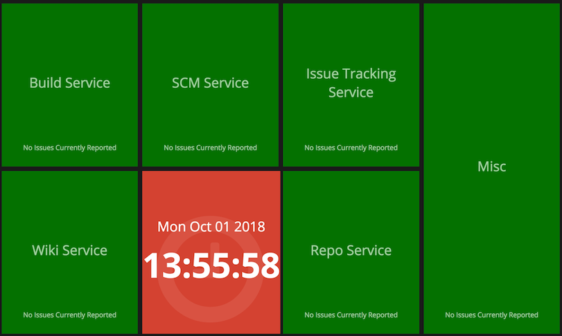

### Check Smashing can receive updates

Send a simple update to Smashing. In the terminal execute:

```
curl -d '{ "auth_token": "playground", "text": "Update from DevOps Playground!" }' http://\<IP\>:9292/widgets/welcome
```

Check the sample dashboard and look for your message update:

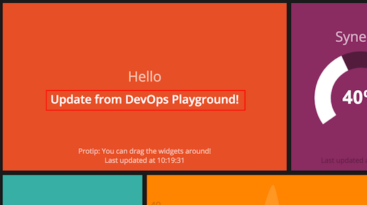


### Configure Jenkins watch in Consul

Now that we have Consul monitoring our services and a Smashing dashboard running. We now want to configure some watches in Consul, so that when ever there is a change in the status os a service, the Smashing dashboard is updated.

Navigate to the Consul watch definition files.

```
$cd ~/devopsplaygroundsg02-hashicorpconsulandsmashing/consul/watches
```

Use nano to configure the watch definition file for Jenkins.

```
$nano jenkins_watch.json
```

Replace <JENKINS SERVICE NAME> ...

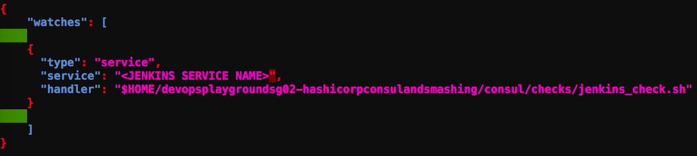

... with the name of the Jenkins service (jenkins)

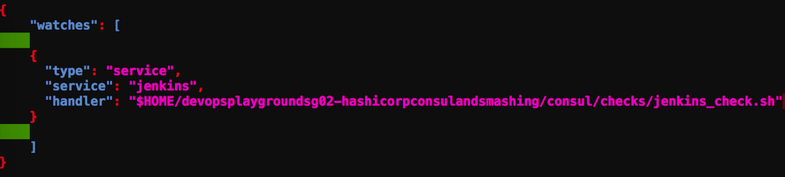

Move the Jenkins watch definition file to the consul configuration directory.

```
$cp jenkins_watch.json ~/consul_config/
```

Reload consul to pick up the latest changes.

```
$consul reload
```

### Configure Artifactory watch in Consul


Navigate to the Consul watch definition files.

```
$cd ~/devopsplaygroundsg02-hashicorpconsulandsmashing/consul/watches
```

Use nano to configure the watch definition file for Artifactory.

```
$nano artifactory_watch.json
```

Replace <Artifactory SERVICE NAME> ...

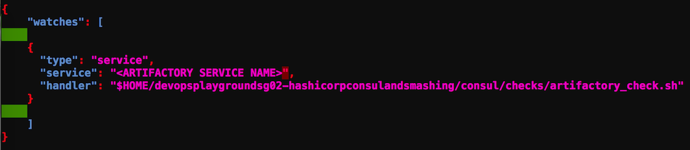

... with the name of the Artifactory service (artifactory)

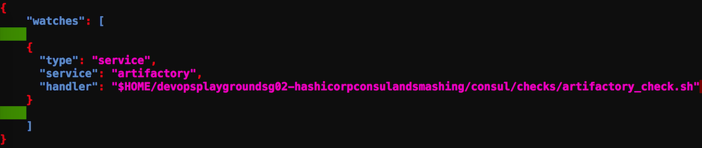

Move the Artifactory watch definition file to the consul configuration directory.

```
$cp artifactory_watch.json ~/consul_config/
```

Reload consul to pick up the latest changes.

```
$consul reload
```

### Shutdown Jenkins and Artifactory

Shutdown the Jenkins Service.

```
$sudo service jenkins stop
```

Shutdown the Artifactory Service.

```
$sudo service artifactory stop
```

Check the Consul UI, both Jenkins and Artifactory services should be displayed as critical.

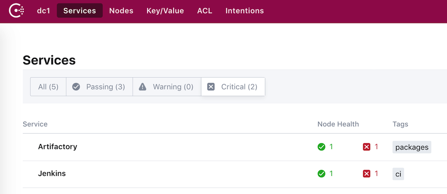

Now check the Smashing dashboard:

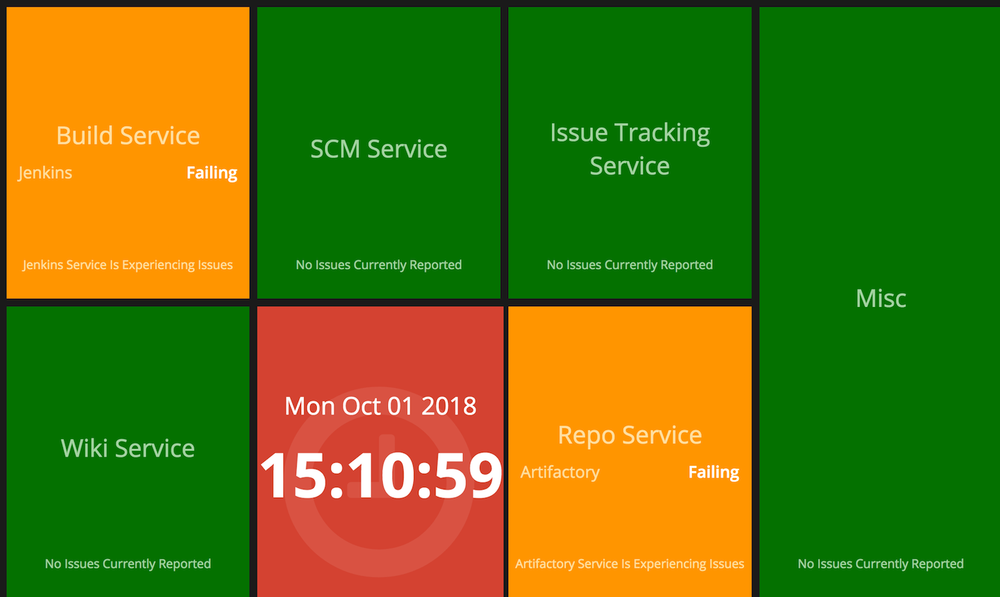


### Startup Jenkins and Artifactory

Startup the Jenkins Service.

```
$sudo service jenkins start
```

Startup the Artifactory Service.

```
$sudo service artifactory start
```

Check the Consul UI, both Jenkins and Artifactory services should be displayed as healthy.

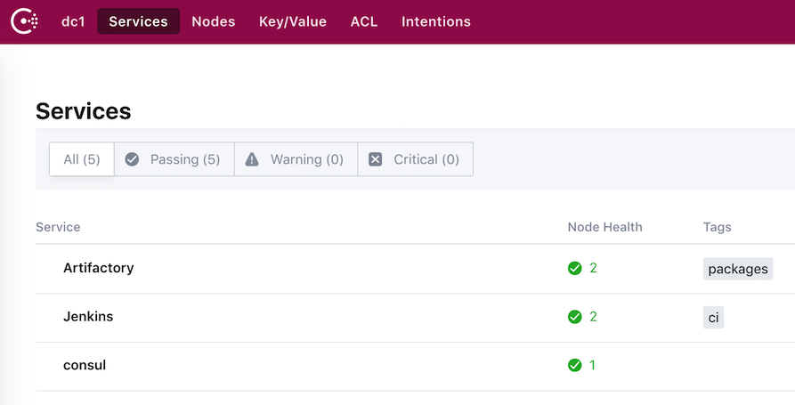


Now check the Smashing dashboard:

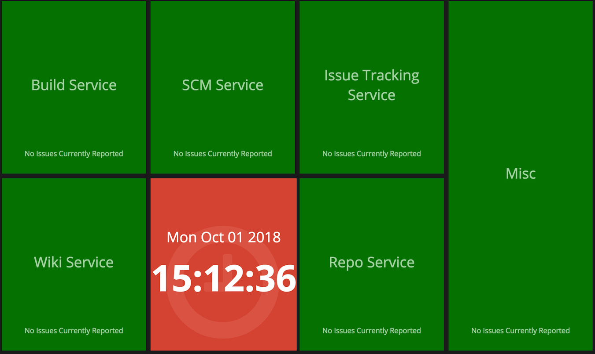


# Conclusion

In this playground we had an environment containing a build server (Jenkins) and a package repo(Artifactory) and installed and configured Hashicorp Consul to regularly monitor the health of these services. We installed a Smashing dashboard and configured a couple of Consul watches so that we can display the statuses of our services with an eye pleasing dashboard that can be displayed on TVs around the office.

To ensure a more robust implementation within the workplace, this playground can be extended to include the following:

1. Integrate with Jira to raise a ticket each time a service outage is experienced.
2. Push outage data to Graphite so that historical trends can be analysed for better root cause analysis.
3. Automatic notifications sents to the appropriate parties when a particular service is offline.
4. Setup a Consul cluster.

We hope this playground has helped provide you with a better understanding of the monitoring capabilites provided by Consul and how those statuses can be easily displayed in a Smashing dashboard. Think about the service you are responsible for maintaining and see whether this playground can help you improve viability of the health of those services.

# Hashicorp Training

If you would like to further your knowledge with the Hashicorp product suite. Consider booking a training course with one of ECS Digital certified Hashicorp trainers.

For more informtaion check out the link below:

https://ecs-digital.co.uk/what-we-do/training

# Resources
### Hashicorp Consul

Product Details
https://www.consul.io/ 

Documentation
https://www.consul.io/docs/index.html


### Smashing

Product Details
https://smashing.github.io/

Documentation
https://github.com/Smashing/smashing/wiki


### Wetty

Repo
https://github.com/krishnasrinivas/wetty


### Hashicorp Terraform

Product Details
https://www.terraform.io/

Documentation
https://www.terraform.io/docs/index.html


### Jenkins

Product Details
https://jenkins.io/

Documentation
https://jenkins.io/doc/


### Artifactory

Product Details
https://jfrog.com/artifactory/

Documentation
https://www.jfrog.com/confluence/pages/viewpage.action?pageId=46107472


# Appendix

### Setting up the Playground Environment

Ensure you have the latest version of terraform installed.

Set the following environment variables:

```
$export AWS_ACCESS_KEY_ID=<YOUR KEY ID>
$export AWS_SECRET_ACCESS_KEY=<YOUR ACCESS KEY>
```

Navigate to the _setup directory and execute:

```
$terraform init
```

Then execute:
```
$terraform plan
```

Finally, run the following and specify the number of instances you want to create:

```
$terraform apply -var count_var=1
```

Monitor the output for an ip address. Copy this to your browser.
```
...
Apply complete! Resources: 6 added, 0 changed, 0 destroyed.

Outputs:

ec2_ips = [
    1.2.3.4
]
...
```

Login with the credentials specified in '_setup/scripts/userdata.sh'

Enjoy!

### Tearing down the Playground Environment

Navigate to the _setup directory and execute:

```
$terraform destroy
```

Simples!
